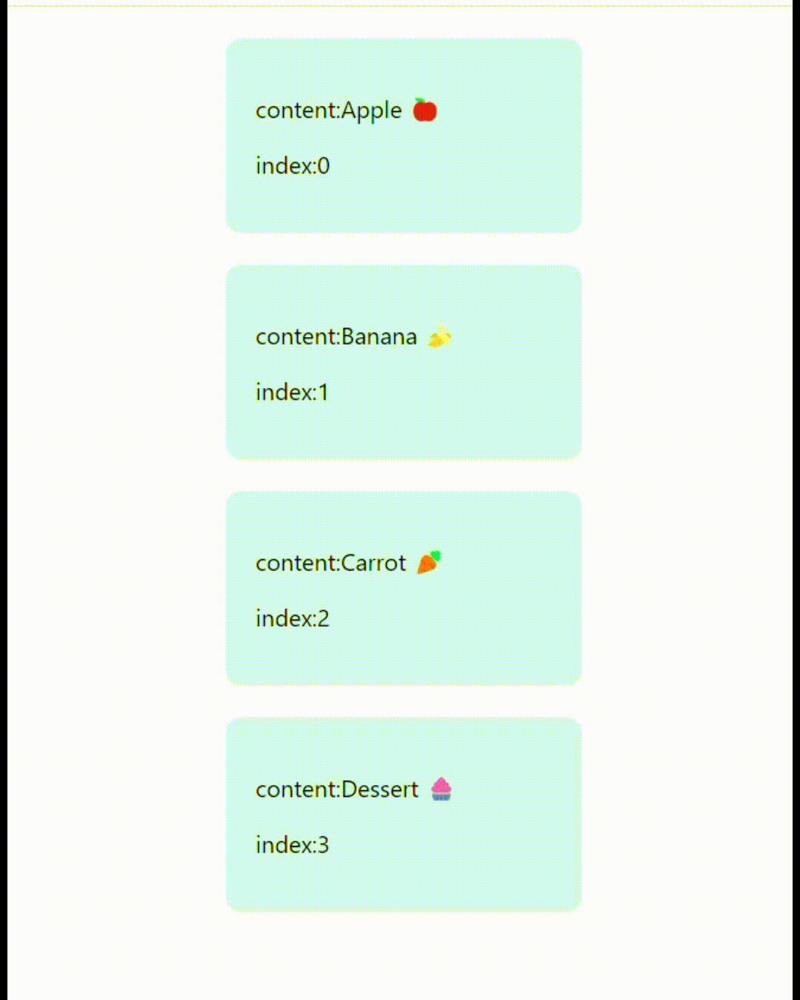
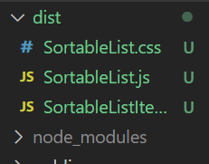

# Sortable

[🖱️프로젝트 사이트 바로가기](https://badahertz52.github.io/sortable)

[🔗sortable-list 패키지 바로가기](https://www.npmjs.com/package/@badahertz52/sortable-list)

### Index

#### <a href="#sortable">1.Sortable</a>

- <div id="#introduce">1) 소개</div>
- <div id="#use"> 2)Sortable 사용 방법</div>

#### <a href="#skill">2.Skill & Scripts</a>

#### <a href="#study">3.배운 것</a>

- <a href="#event"> 1) drag event </a>
- <a href="#npm"> 2) npm에 패키지 배포 </a>

---

## <div id="sortable">1. Sortable</div>

## <div id="#introduce">1) 소개</div>



Sortable 프로젝트는 마우스의 드래그, 드롭을 이용해 아이템을 재정렬할 수 있는 기능을 react를 사용해 구현하고 이를 npm에 배포하는 것을 목적으로 한 프로젝트입니다.

## <div id="#use"> 2) Sortable 사용 방법</div>

### A. 설치

```bash
npm i @badahertz52/sortable-list
```

### B. 설명

### a. 컴포넌트

#### ⓐ SortableItem

사용자가 지정한 data 속의 아이템들을 감싸고 있는 html요소, 마우스의 드래그,드롭 이벤트를 통해 재정렬된다.

```js
const SortableItem = ({ props }) => {
  return <li>{props.children}</li>;
};
```

- SortableItem의 props
  |props|설명|
  |---|---|
  | index|SortableItem이 감싸고 있는 data 속 아이템의 index |
  draggable|마우스로 드래그 할 수 있는 지 여부 <br/> type:boolean|
  children|data 속의 아이템을 화면에 표시하는 컴포넌트 ,<br/> 예시 : <a href="#testItem"> TestItem </a>|
  onDragStart| 드래그 시,startIndex의 상태를 드래그되는 아이템의 index로 변경하는 함수 |
  onDropItem| 아이템을 드롭 시, 드롭되는 위치에 맞게 아이템을 재정렬하는 함수|
  onClickItem|정렬된 아이템들을 클릭 할 때 발생하는 이벤트|
  <br/>

#### ⓑ SortableList

여러 개의 SortableItem을 가지고 있는, SortableItem의 부모 요소

- SortableList의 props
  |props|설명|
  |---|---|
  |data|정렬할 아이템들을 담은 배열로 배열안 요소의 형식은 사용자가 지정할 수 있다 <br/>
  type: Array|
  |onClickItem|정렬된 아이템들을 클릭 할 때 발생하는 이벤트 |
  |renderItem| SortableItem의 children 요소를 반환하는 함수로 정렬할 아이템을 화면상에 어떻게 보일 지를 결정한다. <br/> parameter: item (data의 item), index(item의 data 속 index) |

### b. 사용 예시

- App.js

```js
import SortableList from "@badahertz52/sortable-list";
import { data } from "./TestItem/testData";
import TestItem from "./TestItem/TestItem";
function App() {
  const onClickItem = (index) => {
    alert(index);
  };
  return (
    <SortableList
      data={data}
      renderItem={(item, index) => <TestItem data={item} index={index} />}
      onClickItem={onClickItem}
    />
  );
}

export default App;
```

- <div id="testItem"> TestItem.jsx </div>

```js
import React from "react";
import "./TestItem.css";
function TestItem({ data, index }) {
  return (
    <div className="test-item">
      <div>
        <p>content:{data.content}</p>
        <p>index:{index}</p>
      </div>
    </div>
  );
}

export default TestItem;
```

- testData.js

```js
export const data = [
  { content: "Apple 🍎" },
  { content: "Banana 🍌" },
  { content: "Carrot 🥕" },
  { content: "Dessert 🧁" },
];
```

## <div id="skill">2. Skill & Scripts</div>

### Skill

- HTML, CSS, JS
- React

### install

```bash
npm i
```

### start

```bash
npm run start
```

### publish

```bash
npm publish
```

## <div id="study">3.배운 것</div>

## <div id="event"> 1) drag event </div>

drag 이벤트는 텍스트를 사용자가 드래그하는 동안 매 수백 밀리초마다 발생하는 DOM 이벤트로, dragstart, dragend,dragover,dragenter,dragleave, drop 가 있다.

- dragstart : 드래그 가능한 요소를 마우스로 클릭하고 움직일 때 (드래그를 시작할 때) 발생
- dragend: 드래그를 끝낼 때 발생
- dragover : 드래그 가능한 요소가 드롭 대상 요소 위에 있을 때 수백 밀리초 마다 발생
- dragenter : 드래그 가능한 요소가 드롭 대상 요소 안으로 들어갈 때 발생
- dragleave:드래그 가능한 요소가 드롭 대상 요소 밖으로 나갈 때 발생
- drop : 드래그 가능한 요소가 드롭 대상 요소에 놓아졌을 때 발생

notion 프로젝트에서 블록의 위치를 바꾸는 기능이 있는데 프로젝트 개발 당시에는 click,move (모바일에서는 touch) 이벤트를 통해 기능을 구현했는데 drag 이벤트가 있다는 것을 알았더라면, 더 조사해봤더라면 좋았겠다는 생각을 했다.

## <div id="npm"> 2) npm에 패키지 배포 </div>

프로젝트를 진행하면서 배운 npm에 패키지를 배포하는 방법이다.

### A. 바벨 설치

```bash
npm i -D @babel.cli @babel/preset-react
```

- babel.cline :터미널에서 Babel 명령어를 사용할 수 있게 해준다.
- babel/preset-react : React 관련 플러그인들의 모음인 프리셋(Babel 의 변환 규칙을 미리 정의한 것)이다. JSX 문법을 자바스크립트로 바꾸어주는 플러그인등이 포함되어 있다.

### B. package.json 설정

```json
{
  "name": "@badahertz52/sortable-list",
  "module": "dist/SortableList.js",
  "main": "dist/SortableList.js",
  "version": "0.1.0",
  "private": false,
  //....
  "scripts": {
    //...
    "publish": "rm -rf dist && mkdir dist && babel src/lib -d dist --copy-files"
  },
  //....
  "devDependencies": {
    "@babel/cli": "^7.22.5",
    "@babel/preset-react": "^7.22.5"
  },
  //....
  "babel": {
    "presets": ["@babel/preset-react"]
  }
}
```

- name : npm 패키지명으로 유일무이해야한다. 앞에 @npm의 username을 붙이면 중복되는 패키지명 오류를 피하는 데 좋다.
- module, main : 패키지의 진입점을 정의하는 것으로 패키지의 root 파일을 설정한다고 생각하면 된다. 위에서는 dist 폴더의 SortableList.js를 설정했다.
- private: 패키지를 공개할 것인지 비공개할 것인지에 대한 설정으로 공개시에는 false, 비공개시에는 true로 설정하면 된다.
- scripts의 publish :

  - rm -rf dist : dist 폴더 있으면 삭제
  - mkdir dist : dist 폴더 생성
  - babel src/lib -d dist --copy-files : 바벨을 이용해, src/lib에 생성한 것들을 dist에 생성
  - npm run publish 를 사면 src/lib 에 생성된 파일들인 dist 폴더에 생성된다.

    

### C. .gitignore 추가

gitignore에 다음을 추가한다.

```
...
/src
/public
...
```

src, public의 변경은 git에 담기지 않기 때문에 <span style="color:#0054b9"> **반드시 배포하기 전에 npm urn publish 로 변경사항은 dist에 반영해주어야 한다.** </span>

### D. npm login

프로젝트 터미널에서 다음 명령어를 사용하여 npm 에 로그인을 해준다.

    ```bash
     npm login
    ```

차례 대로 유저네임, 비밀번호, 이메일, 이메일 인증 번호를 입력하면 되는데 비밀번호 입력 시 보안상의 이유로 텍스트가 화면에 표시되지 않기 때문에 화면에 표시되는 것이 없다해도 당황하지 말고 입력하면 된다.

### E. 패키지 배포

    패키지를 처음 배포하는 경우라면 다음의 명령어를 사용하면 된다.
    ```bash
     npm publish ---access public
    ```
    이때
    "'rm'은(는) 내부 또는 외부 명령, 실행할 수 있는 프로그램, 또는 배치 파일이 아닙니다." 라는 오류를 나온다면, cmd 가 아닌 git bash 창에서 명령어을 입력하면 오류가 발생하지 않는다.

    이후에 패키지를 수정/보안해서 재배포하는 경우라면 package.json 속 version을 수정한 후 다음의 명령어를 사용하면 된다.
    ```bash
    npm public
    ```
